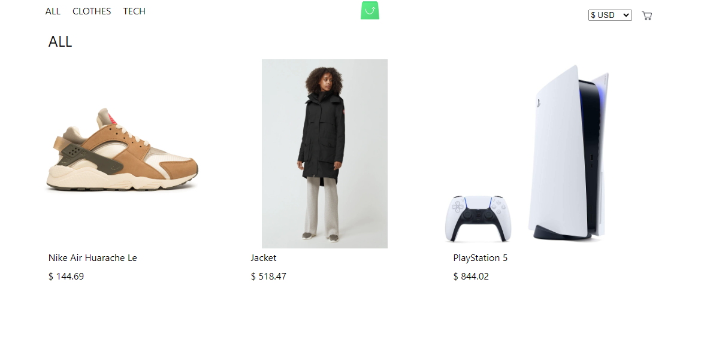
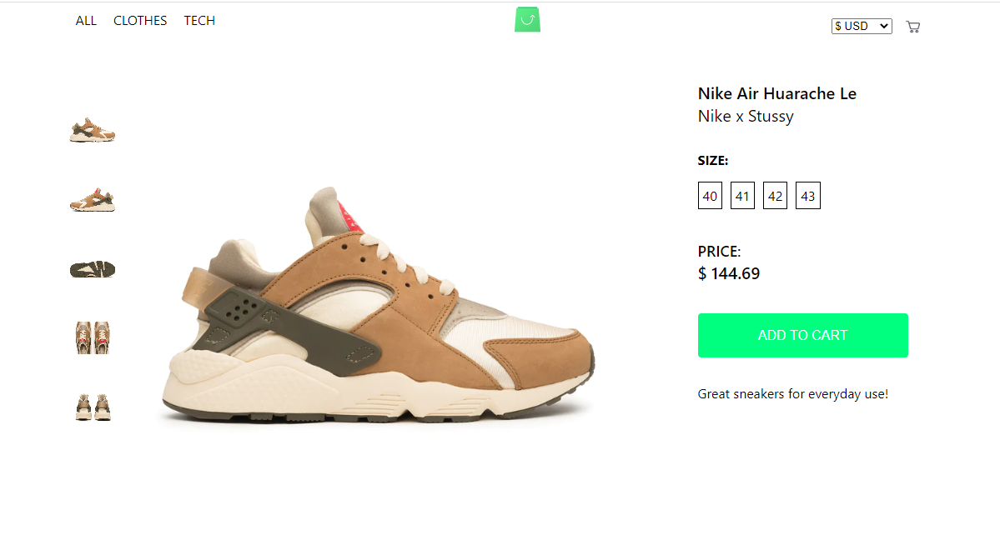
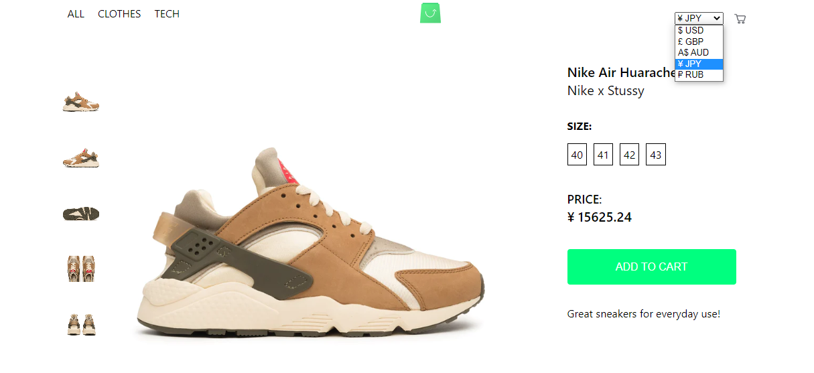
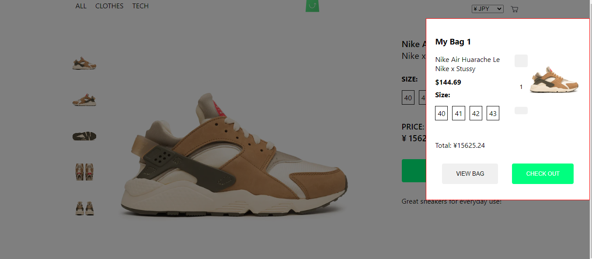

# SCANDIWEB
This is a mini online store where items are displayed by categories.

### Features

- Currency Switcher

- Variant selection

- Add to Cart, remove from cart, update quantity in cart
 

[Demo Link]()

## Prerequisites
- Internet
- Computer

### Install and Setup
- Clone repo to your local ``
- cd into the cloned repo
- Create a .env file in the root of the repository
- Add all necessary environment variables to .env file (Check .env.sample file for required variables)
- Open a terminal in the root of the app
- Run `npm install` to install dependencies
- Run Start up your server with `npm run start`
- Open http://localhost:3000/ in your browser.

### Testing
- Open a terminal and run `npm run test`.

